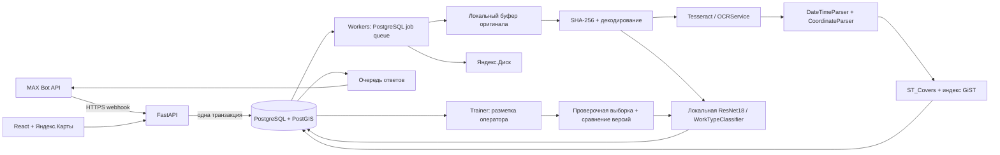

# Архитектура

## Решения

Очередь работает в PostgreSQL, без Redis. Входящее событие, строки вложений и задание сохраняются одним коммитом. Это исключает окно «БД сохранилась, Celery-задача потерялась». Для текущего масштаба отдельный брокер не нужен; интерфейсы позволяют добавить его позднее.

Рабочие процессы выбирают готовые задачи и захватывают session advisory lock по ID. Зависшая после аварии RUNNING-задача автоматически доступна следующему worker после закрытия соединения PostgreSQL. Ошибки повторяются с экспоненциальной задержкой до часа. Задания SYNC и REGEO переживают рестарты независимо от API.

До первичного анализа оригинал атомарно скачивается в `.part`, fsync и rename. SHA-256 берётся с оригинальных байтов. Глобальная блокировка по хэшу и уникальный индекс защищают от одновременного приёма одного файла из разных чатов. Для отклонённых/пересланных и дублей `sha256=NULL`: отдельная строка сохраняет статистику события, а единственная каноническая фотография владеет хэшем.

У фотографии есть независимые состояния распознавания и хранения. `analyzed_at` предотвращает повторный вызов OCR/AI после сбоя загрузки. `storage_status` показывает PENDING/SYNCED/ERROR/NOT_REQUIRED. Перед удалением буфера проверяется удалённый SHA-256 и фиксируется путь в БД. Повтор после аварии сначала сверяет целевой ресурс: существующий файл с другим хэшем не перезаписывается.

Изменения оператора блокируются по ID фотографии, сравнивают версию и записывают аудит/задачу переноса в одной транзакции. SYNC читает текущие данные фотографии, а не устаревший снимок полей из очереди. Сбой API Диска не откатывает решение оператора и не меняет уже подтверждённый путь в БД.

Администратор рисует мультиполигоны WGS84. GeoJSON проверяется Shapely, пересечения — PostGIS. `ST_Covers` включает границы; если точка относится к нескольким территориям, микрорайон не назначается. Простое соседство по общей границе не блокирует сохранение, но точка на этой границе остаётся неоднозначной. Изменения границ/названий запускают пересчёт существующих принятых фотографий и синхронизацию путей.

## Основные таблицы

| Таблица | Назначение / ключи |
|---|---|
| users | Пользователи, роли, Argon2id, активность |
| login_sessions | Хэши случайных токенов сессии/CSRF, срок действия |
| login_attempts | Ограничение входа по аккаунту и IP |
| chats | Разрешённые чаты, unique MAX chat ID, состояние приёма |
| districts | MultiPolygon SRID 4326, пространственный GiST-индекс |
| inbox | Уникальная пара chat ID / message ID, единый ответ набора |
| photos | Файл и весь OCR/AI/географический/операторский контекст, unique SHA-256 |
| jobs | Тип, объект, уникальный ключ, попытки, следующая попытка, ошибка |
| model_versions | Снимок разметки, метрики, состояние, хэш и путь весов локальной модели |
| audit_logs | Кто/когда/какой объект/до/после; история неизменяема через API |

Миграция 0002 добавляет версии локальной модели. Миграция 0001 содержит зафиксированную схему и не вызывает `create_all` с будущими ORM-моделями. Все даты получения/аудита timezone-aware UTC; дата съёмки и время на штампе хранятся отдельными полями. Часовой пояс отчётов конфигурируется.

## Границы гарантий

- Доставка webhook допускает повтор; запись набора и задания идемпотентна.
- OCR и классификация выполняются локально. Авария между вычислением и коммитом анализа может повторить вычисление, но не создаёт второй файл.
- Транспорт MAX не документирует exactly-once отправку ответа; окно повтора ответа описано в README.
- Авария после коммита облачного пути до удаления локальной копии может оставить лишнюю копию в буфере. Она не является отдельной фотографией; сверяйте хэш/БД перед обслуживанием буфера.
- Реальная точность распознавания требует репрезентативной выборки. Необученная модель, неподдерживаемая категория, отказ модели и низкая уверенность идут оператору.
- Оригиналы и превью доступны только после авторизации. Ссылка на скачивание оригинала Яндекс.Диска временная и выдаётся через защищённый endpoint.

## Локальное обучение

`trainer` потребляет только задания TRAIN; обычные workers их пропускают. Планировщик и ручной запуск сериализуются advisory lock, а обучение защищено отдельным session lock. После падения процесса старый незавершённый запуск помечается INTERRUPTED, задача повторяется. Ошибка обучения не меняет активную версию.

В выборке используются локальные превью и только OPERATOR-метки с reviewed_by. SHA-256 задаёт постоянное разделение обучения/проверки. Веса никогда не обучаются на проверочной части. На каждом цикле последний блок ResNet18 и новая голова обучаются на всей накопленной обучающей части, начиная с общих ImageNet-признаков. Метрики macro F1 и precision/recall по классу определяют допуск; текущая и новая модели сравниваются на одном holdout. Изменение меток во время обучения проверяется перед активацией.

Веса записываются через временный файл и атомарное переименование, затем сохраняются SHA-256 и состояние в БД. Частичный уникальный индекс разрешает только одну ACTIVE-модель. Каждый worker читает ID активной модели и держит небольшой кэш; новые фотографии используют новую версию без рестарта. Существующие ручные решения автоматически не переписываются.

Яндекс.Карты подключаются с `coordorder=longlat`, что соответствует GeoJSON/PostGIS. Polygon/MultiPolygon и внутренние кольца сохраняются без перестановки координат. Браузер получает только ключ карты, не токены MAX/Диска. MAX использует `verify=False` при `MAX_VERIFY_TLS=false` (значение по умолчанию); политика TLS остальных интеграций независима.
